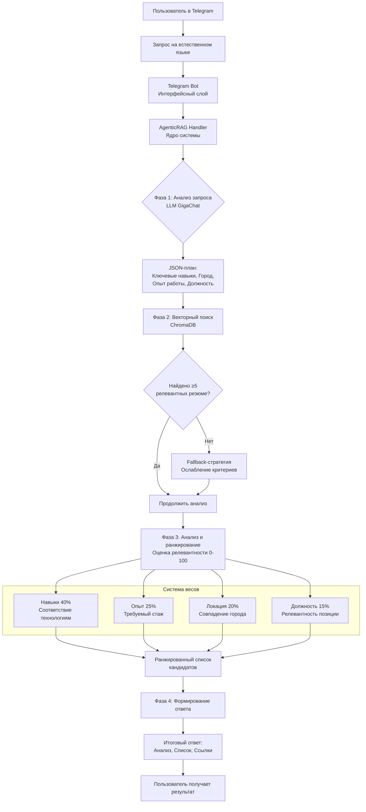
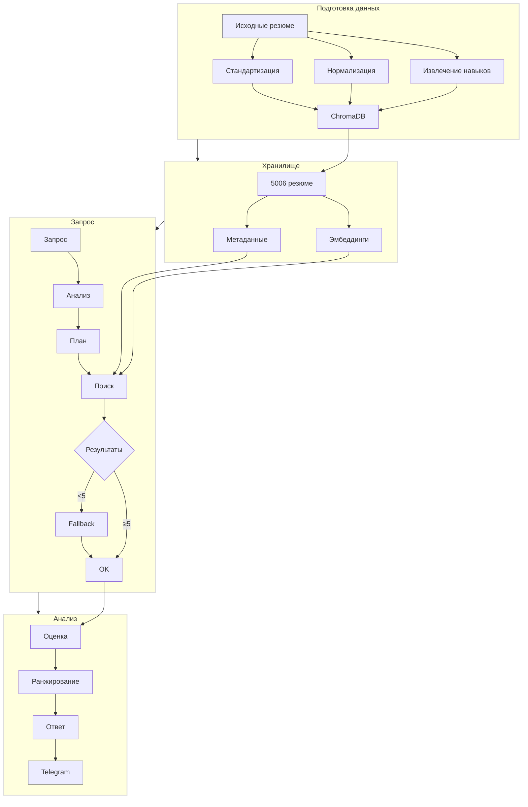

# HR Analytics Bot - AI-аналитик резюме

<div align="center">
  
  
  
  
  
  
  <br>
  
  *Интеллектуальный чат-бот для поиска IT-специалистов по базе резюме с hh.ru*
  
</div>

---

## Содержание

- [Возможности](#возможности)
- [Архитектура системы](#архитектура-системы)
- [Алгоритм работы](#алгоритм-работы)
- [Установка и запуск](#установка-и-запуск)
- [Использование бота](#использование-бота)
- [Технические детали](#технические-детали)
- [Структура проекта](#структура-проекта)
- [Примеры работы](#примеры-работы)
- [Дальнейшее развитие](#дальнейшее-развитие)

---

## Возможности

**Интеллектуальный поиск** кандидатов по 5000+ резюме  
**Анализ на естественном языке** — пишите запросы как думаете  
**AgenticRAG архитектура** — GigaChat как агент управляет поиском  
**Фильтрация** по навыкам, городу, опыту работы  
**Автоматический анализ** релевантности с обоснованиями  
**Telegram интерфейс** — удобное взаимодействие  

---

## Архитектура системы

Система построена на **AgenticRAG** (Retrieval-Augmented Generation с агентским управлением), где языковая модель выступает в роли интеллектуального координатора.




### Ключевые компоненты

| Компонент | Технология | Назначение |
|-----------|------------|------------|
| Telegram Bot | aiogram 3.x | Интерфейс пользователя |
| AgenticRAG Handler | Python + GigaChat | Интеллектуальный координатор |
| Векторная БД | ChromaDB | Хранение и поиск резюме |
| Модель эмбеддингов | all-MiniLM-L6-v2 | Семантические эмбеддинги |
| Обработка данных | Custom Pipeline | Подготовка и обогащение резюме |

---

## Алгоритм работы

## Алгоритм работы

Система использует 4-фазный алгоритм AgenticRAG для интеллектуального поиска кандидатов. Каждая фаза выполняет специфическую задачу, обеспечивая высокую точность и релевантность результатов.

### Фаза 1: Анализ и планирование запроса

**Вход**: Естественно-языковой запрос пользователя (например, "Найди React-разработчиков в Москве с опытом от 3 лет")

**Процесс**: LLM (GigaChat) анализирует запрос, выделяя ключевые параметры:
- Технологии и навыки (React, TypeScript, Redux)
- Локация (Москва, удалённая работа)
- Требования к опыту (от 3 лет, senior/middle)
- Должность (фронтенд, бэкенд, fullstack)

**Выход**: Структурированный план поиска, который включает список поисковых запросов и фильтров для векторной базы данных.

### Фаза 2: Многоэтапный векторный поиск

Система выполняет итеративный поиск с постепенным ослаблением критериев:

1. **Первичный поиск** с полным набором фильтров
2. **Если <5 результатов** → ослабляем требования к опыту
3. **Если всё ещё мало** → убираем требования к локации
4. **Финальный этап** → поиск только по ключевым навыкам

Каждый этап использует семантические эмбеддинги модели `all-MiniLM-L6-v2` для поиска в ChromaDB.

### Фаза 3: Оценка и ранжирование релевантности

Найденные резюме оцениваются по взвешенной системе:

| Критерий | Вес | Метод оценки |
|----------|-----|--------------|
| Навыки | 40% | Наличие требуемых технологий в поле `all_skills` |
| Опыт работы | 25% | Сравнение с `min_experience_years` |
| Локация | 20% | Точное или частичное совпадение города |
| Должность | 15% | Релевантность `desired_position` запросу |

**Формула оценки**:
`Общий балл = (Навыки × 0.4) + (Опыт × 0.25) + (Локация × 0.2) + (Должность × 0.15)`

### Фаза 4: Формирование итогового ответа

GigaChat анализирует ранжированный список и создает структурированный ответ:

1. **Краткий анализ** - обоснование выбранных кандидатов
2. **Ранжированный список** - кандидаты с оценками и ключевыми компетенциями
3. **Ссылки на резюме** - прямые ссылки на hh.ru
4. **Статистика поиска** - количество найденных и отфильтрованных резюме

Пример выходного формата:
```
JSON
{
  "thought_process": "Пользователь ищет React-разработчиков в Москве с опытом от 3 лет. Основные параметры: технологии (React и смежные), город (Москва), минимальный опыт (3 года).",
  "search_queries": [
    "React разработчик",
    "Frontend React developer",
    "React программист"
  ],
  "filters": {
    "location": "москва",
    "min_experience_years": 3,
    "required_skills": ["React", "React.js", "JavaScript"]
  },
  "analysis_instructions": "Оценить кандидатов на соответствие запросу: наличие опыта работы с React, проживание в Москве или готовность к переезду, общий опыт разработки не менее 3 лет.",
  "requires_refinement": false
}
```

---

## Установка и запуск

Этот раздел будет детализирован на следующих шагах.

---

## Использование бота

Этот раздел будет детализирован на следующих шагах.

---

## Технические детали

## Технические детали


---

## Структура проекта

Этот раздел будет детализирован на следующих шагах.

---

## Примеры работы

Этот раздел будет детализирован на следующих шагах.

---

## Дальнейшее развитие

Этот раздел будет детализирован на следующих шагах.

---

<div align="center">
  
  <br>
  
  **Если проект полезен — поставьте звезду на GitHub!**
  
  <br>
  
  
  
  <br>
  
  *Последнее обновление: декабрь 2025*
  
</div>
