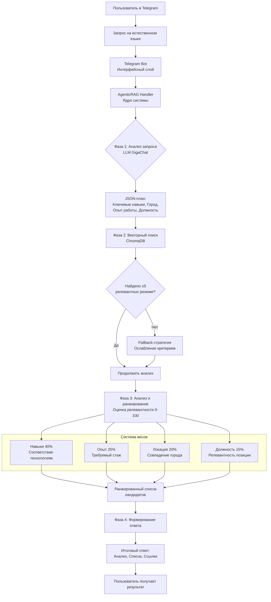
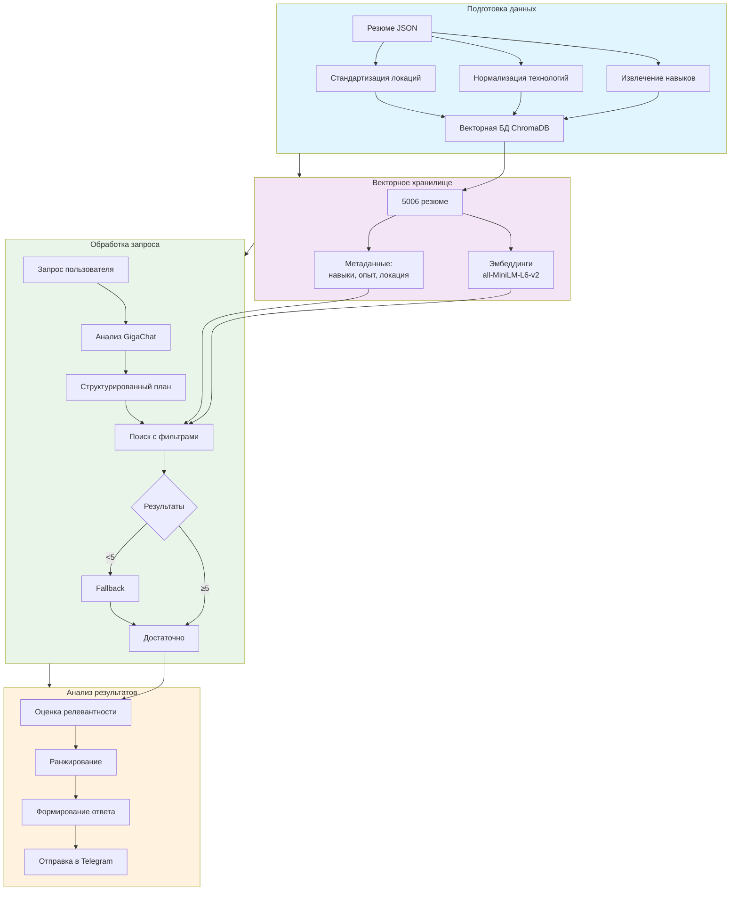

# HR Analytics Bot - AI-аналитик резюме

  
  
  
  
  
  
   
  
  *Интеллектуальный чат-бот для поиска IT-специалистов по базе резюме с hh.ru*
  

---

## Содержание

- [Возможности](#возможности)
- [Архитектура системы](#архитектура-системы)
- [Алгоритм работы](#алгоритм-работы)
- [Установка и запуск](#установка-и-запуск)
- [Использование бота](#использование-бота)
- [Технические детали](#технические-детали)
- [Структура проекта](#структура-проекта)
- [Примеры работы](#примеры-работы)
- [Дальнейшее развитие](#дальнейшее-развитие)

---

## Возможности

**Интеллектуальный поиск** кандидатов по 5000+ резюме  
**Анализ на естественном языке** — пишите запросы как думаете  
**AgenticRAG архитектура** — GigaChat как агент управляет поиском  
**Фильтрация** по навыкам, городу, опыту работы  
**Автоматический анализ** релевантности с обоснованиями  
**Telegram интерфейс** — удобное взаимодействие  

---

## Архитектура системы

Система построена на **AgenticRAG** (Retrieval-Augmented Generation с агентским управлением), где языковая модель выступает в роли интеллектуального координатора.

### Ключевые компоненты

| Компонент | Технология | Назначение |
|-----------|------------|------------|
| Telegram Bot | aiogram 3.x | Интерфейс пользователя |
| AgenticRAG Handler | Python + GigaChat | Интеллектуальный координатор |
| Векторная БД | ChromaDB | Хранение и поиск резюме |
| Модель эмбеддингов | all-MiniLM-L6-v2 | Семантические эмбеддинги |
| Обработка данных | Custom Pipeline | Подготовка и обогащение резюме |

---

## Алгоритм работы

Этот раздел будет детализирован на следующих шагах.

---

## Установка и запуск

Этот раздел будет детализирован на следующих шагах.

---

## Использование бота

Этот раздел будет детализирован на следующих шагах.

---

## Технические детали

## Технические детали

---

## Структура проекта

Этот раздел будет детализирован на следующих шагах.

---

## Примеры работы

Этот раздел будет детализирован на следующих шагах.

---

## Дальнейшее развитие

Этот раздел будет детализирован на следующих шагах.

---

  
   
  
  **Если проект полезен — поставьте звезду на GitHub!**
  
   
  
  
  
   
  
  *Последнее обновление: декабрь 2025*
  

