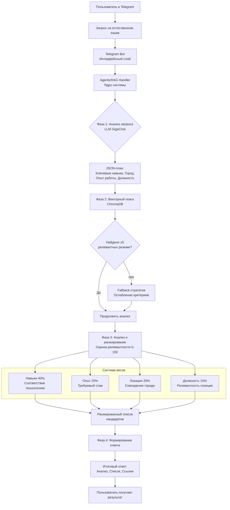
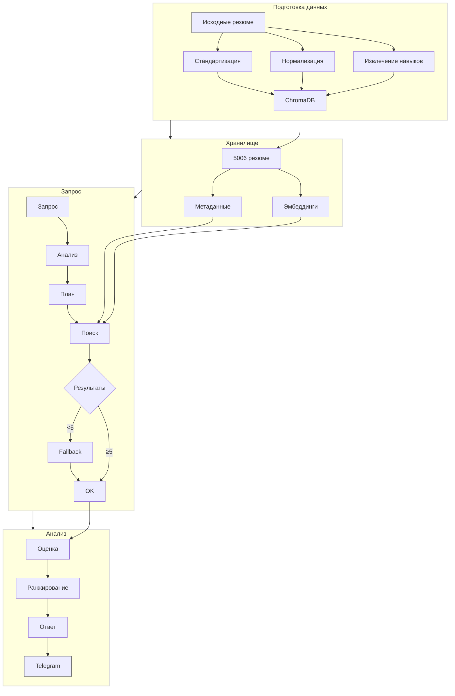

# HR Analytics Bot - AI-аналитик резюме

<div align="center">
  
  
  
  
  
  
  <br>
  
  *Интеллектуальный чат-бот для поиска IT-специалистов по базе резюме с hh.ru*
  
</div>

---

## Содержание

- [Возможности](#возможности)
- [Архитектура системы](#архитектура-системы)
- [Алгоритм работы](#алгоритм-работы)
- [Установка и запуск](#установка-и-запуск)
- [Технические детали](#технические-детали)
- [Структура проекта](#структура-проекта)

---

## Возможности

**Интеллектуальный поиск** кандидатов по 5000+ резюме  
**Анализ на естественном языке** — пишите запросы как думаете  
**AgenticRAG архитектура** — GigaChat как агент управляет поиском  
**Фильтрация** по навыкам, городу, опыту работы  
**Автоматический анализ** релевантности с обоснованиями  
**Telegram интерфейс** — удобное взаимодействие  

---

## Архитектура системы

Система построена на **AgenticRAG** (Retrieval-Augmented Generation с агентским управлением), где языковая модель выступает в роли интеллектуального координатора.




### Ключевые компоненты

| Компонент | Технология | Назначение |
|-----------|------------|------------|
| Telegram Bot | aiogram 3.x | Интерфейс пользователя |
| AgenticRAG Handler | Python + GigaChat | Интеллектуальный координатор |
| Векторная БД | ChromaDB | Хранение и поиск резюме |
| Модель эмбеддингов | all-MiniLM-L6-v2 | Семантические эмбеддинги |
| Обработка данных | Custom Pipeline | Подготовка и обогащение резюме |

---

## Алгоритм работы

Система использует 4-фазный алгоритм AgenticRAG для интеллектуального поиска кандидатов. Каждая фаза выполняет специфическую задачу, обеспечивая высокую точность и релевантность результатов.

### Фаза 1: Анализ и планирование запроса

**Вход**: Естественно-языковой запрос пользователя (например, "Найди React-разработчиков в Москве с опытом от 3 лет")

**Процесс**: LLM (GigaChat) анализирует запрос, выделяя ключевые параметры:
- Технологии и навыки (React, TypeScript, Redux)
- Локация (Москва, удалённая работа)
- Требования к опыту (от 3 лет, senior/middle)
- Должность (фронтенд, бэкенд, fullstack)

**Выход**: Структурированный план поиска, который включает список поисковых запросов и фильтров для векторной базы данных.

### Фаза 2: Многоэтапный векторный поиск

Система выполняет итеративный поиск с постепенным ослаблением критериев:

1. **Первичный поиск** с полным набором фильтров
2. **Если <5 результатов** → ослабляем требования к опыту
3. **Если всё ещё мало** → убираем требования к локации
4. **Финальный этап** → поиск только по ключевым навыкам

Каждый этап использует семантические эмбеддинги модели `all-MiniLM-L6-v2` для поиска в ChromaDB.

### Фаза 3: Оценка и ранжирование релевантности

Найденные резюме оцениваются по взвешенной системе:

| Критерий | Вес | Метод оценки |
|----------|-----|--------------|
| Навыки | 40% | Наличие требуемых технологий в поле `all_skills` |
| Опыт работы | 25% | Сравнение с `min_experience_years` |
| Локация | 20% | Точное или частичное совпадение города |
| Должность | 15% | Релевантность `desired_position` запросу |

**Формула оценки**:
`Общий балл = (Навыки × 0.4) + (Опыт × 0.25) + (Локация × 0.2) + (Должность × 0.15)`

### Фаза 4: Формирование итогового ответа

GigaChat анализирует ранжированный список и создает структурированный ответ:

1. **Краткий анализ** - обоснование выбранных кандидатов
2. **Ранжированный список** - кандидаты с оценками и ключевыми компетенциями
3. **Ссылки на резюме** - прямые ссылки на hh.ru
4. **Статистика поиска** - количество найденных и отфильтрованных резюме

Пример выходного формата:
```json
{
  "thought_process": "Пользователь ищет React-разработчиков в Москве с опытом от 3 лет. Основные параметры: технологии (React и смежные), город (Москва), минимальный опыт (3 года).",
  "search_queries": [
    "React разработчик",
    "Frontend React developer",
    "React программист"
  ],
  "filters": {
    "location": "москва",
    "min_experience_years": 3,
    "required_skills": ["React", "React.js", "JavaScript"]
  },
  "analysis_instructions": "Оценить кандидатов на соответствие запросу: наличие опыта работы с React, проживание в Москве или готовность к переезду, общий опыт разработки не менее 3 лет.",
  "requires_refinement": false
}
```

---

## Установка и запуск

### Предварительные требования

- Python 3.9 или новее
- Учетная запись Telegram для создания бота
- Аккаунт на developers.sber.ru для доступа к GigaChat API

### Шаг 1: Получение API ключей

1. **Telegram Bot Token**: Напишите [@BotFather](https://t.me/BotFather) в Telegram, создайте нового бота и получите токен.
2. **GigaChat Credentials**: Зарегистрируйтесь на [developers.sber.ru](https://developers.sber.ru/portal/products/gigachat), создайте приложение и получите учетные данные.

### Шаг 2: Настройка проекта

1. Создайте виртуальное окружение Python
2. Установите зависимости из файла requirements.txt
3. Создайте файл `.env` в корне проекта со следующим содержимым:

```
TELEGRAM_BOT_TOKEN=ваш_telegram_токен_здесь
GIGACHAT_CREDENTIALS=ваши_учетные_данные_gigachat_здесь
```

### Шаг 3: Подготовка данных

1. Поместите файл с резюме (формат JSON из hh.ru) в папку `data/` под именем `resumes.json`
2. Запустите скрипт предобработки данных: `python src/prepare_documents.py`
3. Создайте векторное хранилище: `python src/build_vector_store.py`

Ожидаемый результат: создание папок `data/processed/` и `vectorstore/chroma_db/` с обработанными данными.

### Шаг 4: Запуск бота

Запустите основное приложение: `python src/telegram_bot.py`

При успешном запуске вы увидите в консоли:
- Сообщение о загрузке модели эмбеддингов
- Подтверждение подключения к ChromaDB с количеством резюме
- Подтверждение инициализации GigaChat
- Сообщение о запуске Telegram-бота

### Шаг 5: Проверка работы

1. Откройте Telegram и найдите вашего бота по имени
2. Отправьте команду `/start` для получения приветственного сообщения
3. Проверьте поиск, отправив запрос: "Найди React-разработчиков"

### Структура конфигурационных файлов

**requirements.txt** - список зависимостей Python

**.env.example** - пример файла конфигурации (скопируйте в `.env` и заполните)

**data/resumes.json** - исходные данные в формате экспорта hh.ru

### Устранение неполадок

Если бот не запускается:

1. Проверьте, активировано ли виртуальное окружение
2. Убедитесь, что все зависимости установлены
3. Проверьте корректность токенов в файле `.env`
4. Убедитесь, что векторная база данных создана (папка `vectorstore/` существует)
5. Проверьте наличие файла `data/resumes.json`

Если поиск не возвращает результаты:

1. Убедитесь, что предобработка данных завершилась успешно
2. Проверьте, что в резюме есть указанные технологии
3. Попробуйте более общий запрос: "Найди разработчиков"

### Быстрый старт (краткая версия)

1. Установите зависимости
2. Настройте `.env` с токенами
3. Запустите подготовку данных
4. Запустите бота
5. Проверьте работу в Telegram


---

## Технические детали


---

## Структура проекта

Проект имеет модульную структуру, где каждый компонент отвечает за определенную часть функциональности.

### Корневая структура
```
Study_AI_analytic_CV/
├── src/                       # Исходный код приложения
│   ├── telegram_bot.py       # Основной Telegram бот
│   ├── agentic_rag.py        # Ядро интеллектуального поиска
│   ├── prepare_documents.py  # Обработка резюме
│   └── build_vector_store.py # Создание векторной БД
├── data/                      # Данные и обработанные файлы
│   ├── resumes.json          # Исходные резюме (не в Git)
│   ├── processed/            # Обработанные данные (не в Git)
│   │   ├── documents.jsonl
│   │   ├── metadata.jsonl
│   │   └── stats.json
│   └── README.md             # Описание формата данных
├── vectorstore/               # Векторная база данных
│   └── chroma_db/            # ChromaDB хранилище (не в Git)
├── .env.example              # Пример конфигурации
├── .env                      # Конфигурация с токенами (не в Git)
├── requirements.txt          # Зависимости Python
├── README.md                 # Документация проекта
└── .gitignore                # Игнорируемые файлы
```
### Подробное описание компонентов

#### 1. Исходный код (src/)

| Файл | Назначение |
|------|------------|
| `telegram_bot.py` | Основной файл Telegram-бота. Содержит обработчики команд, взаимодействие с пользователем и интеграцию с AgenticRAG. |
| `agentic_rag.py` | Ядро системы интеллектуального поиска. Реализует AgenticRAG архитектуру, управляет LLM и поиском в векторной БД. |
| `prepare_documents.py` | Модуль предобработки резюме. Извлекает навыки, нормализует технологии, очищает текст и формирует документы для векторного поиска. |
| `build_vector_store.py` | Создание векторного хранилища. Генерирует эмбеддинги и загружает данные в ChromaDB. |

#### 2. Данные (data/)

| Папка/файл | Назначение |
|------------|------------|
| `resumes.json` | Исходные резюме в формате экспорта hh.ru. Содержит структурированные данные о кандидатах. |
| `processed/` | Результаты обработки данных. Автоматически создается после запуска `prepare_documents.py`. |
| `processed/documents.jsonl` | Обработанные документы в формате JSON Lines, готовые для векторизации. |
| `processed/metadata.jsonl` | Метаданные резюме с навыками, локацией, опытом для фильтрации. |
| `processed/stats.json` | Статистика обработки: количество резюме, среднее число навыков и др. |

#### 3. Векторное хранилище (vectorstore/)

| Папка | Назначение |
|-------|------------|
| `chroma_db/` | База данных ChromaDB. Содержит эмбеддинги резюме, метаданные и индексы для быстрого поиска. Автоматически создается после запуска `build_vector_store.py`. |

#### 4. Конфигурационные файлы

| Файл | Назначение |
|------|------------|
| `.env` | Файл конфигурации с секретными данными (токены API). Не отслеживается в Git. |
| `.env.example` | Пример файла конфигурации. Показывает структуру, которую нужно повторить в `.env`. |
| `requirements.txt` | Список зависимостей Python с указанием версий для воспроизводимости окружения. |

### Взаимодействие компонентов

1. **Подготовка данных**: `resumes.json` → `prepare_documents.py` → `data/processed/`
2. **Создание хранилища**: `data/processed/` → `build_vector_store.py` → `vectorstore/chroma_db/`
3. **Работа бота**: Пользователь → `telegram_bot.py` → `agentic_rag.py` → `chroma_db/` → Ответ

### Формат данных

#### Входные данные (resumes.json)
Файл содержит массив резюме в формате экспорта hh.ru. Каждое резюме включает:
- Основную информацию (должность, локация, опыт)
- Список навыков
- Подробное описание опыта работы
- Образование и сертификаты
- Ссылку на оригинальное резюме

#### Обработанные данные
После предобработки создаются:
- **Унифицированный текст** с навыками в начале документа
- **Нормализованные технологии** (приведение к единому формату)
- **Стандартизированные локации** (приведение к общепринятым названиям)
- **Метаданные для фильтрации** (навыки, опыт, локация в структурированном виде)

#### Векторные эмбеддинги
Каждое резюме преобразуется в вектор размерности 384 с помощью модели `all-MiniLM-L6-v2`. Эмбеддинги сохраняются в ChromaDB вместе с метаданными для семантического поиска.

### Размеры данных

| Компонент | Примерный размер | Примечание |
|-----------|------------------|------------|
| `resumes.json` | 50-100 МБ | Исходные данные (не в Git) |
| `data/processed/` | 10-20 МБ | Обработанные данные (не в Git) |
| `vectorstore/chroma_db/` | 100-150 МБ | Векторная база (не в Git) |
| Исходный код | 50-100 КБ | Файлы Python и конфигурация |

### Рекомендации по работе с проектом

1. **Не добавляйте в Git**: Большие файлы данных (`data/`, `vectorstore/`) исключены через `.gitignore`.
2. **Порядок выполнения**: Сначала подготовка данных, затем создание хранилища, только потом запуск бота.
3. **Обновление данных**: Для обновления базы резюме замените `resumes.json` и перезапустите оба скрипта обработки.
4. **Резервное копирование**: Сохраняйте `data/processed/` и `vectorstore/` при необходимости быстрого восстановления.

---

<div align="center">
  
  <br>
  
  **Если проект полезен — поставьте звезду на GitHub!**
  
  <br>
  
  
  
  <br>
  
  *Последнее обновление: декабрь 2025*
  
</div>
